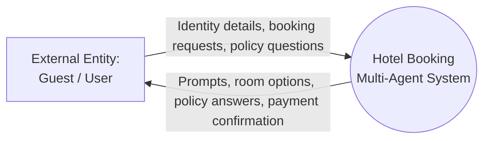
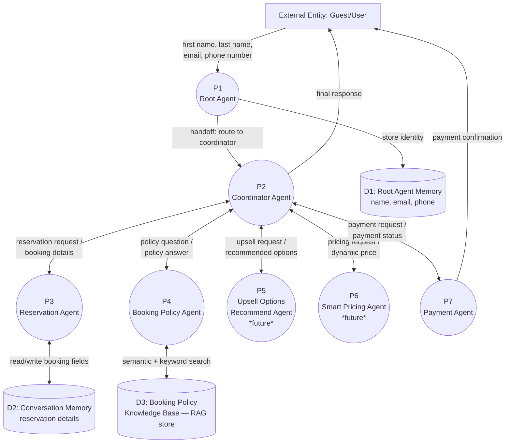
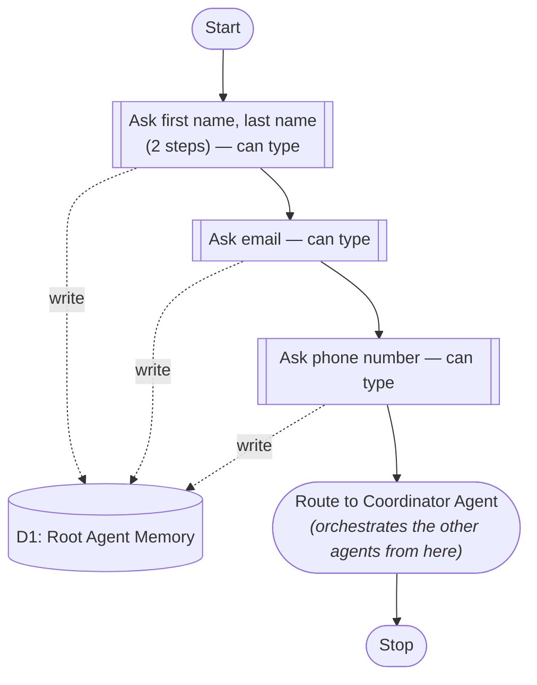
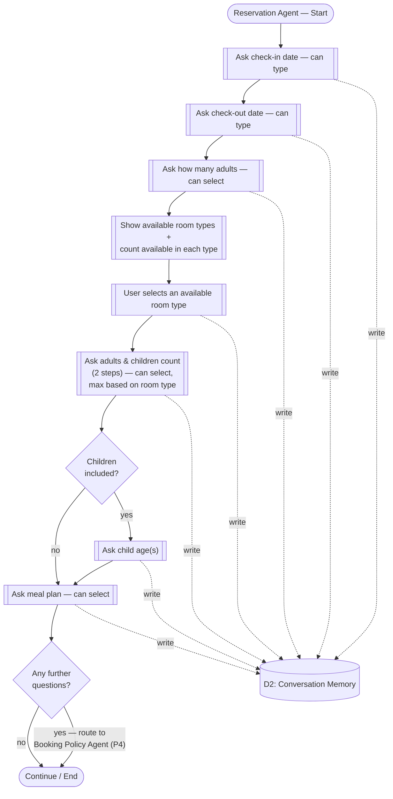
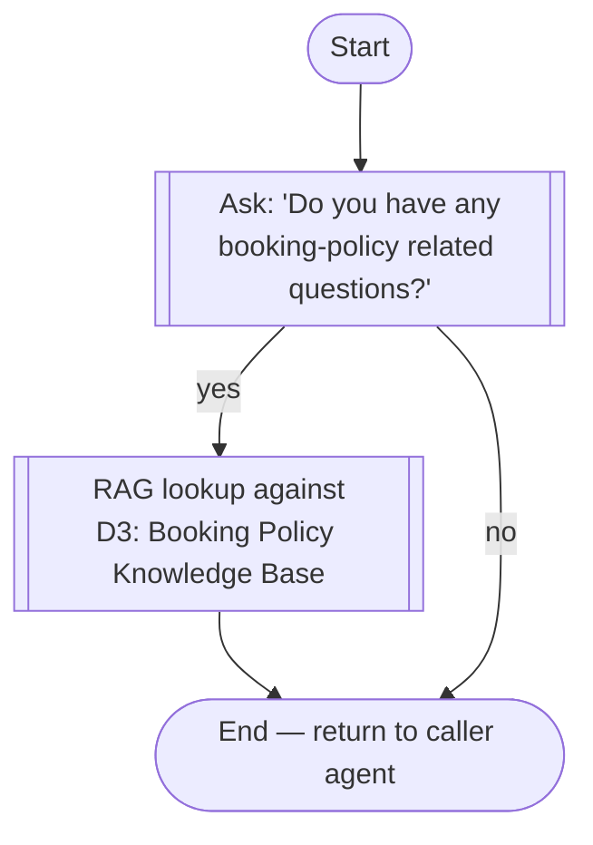
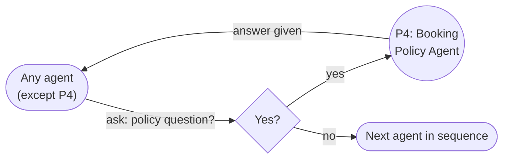
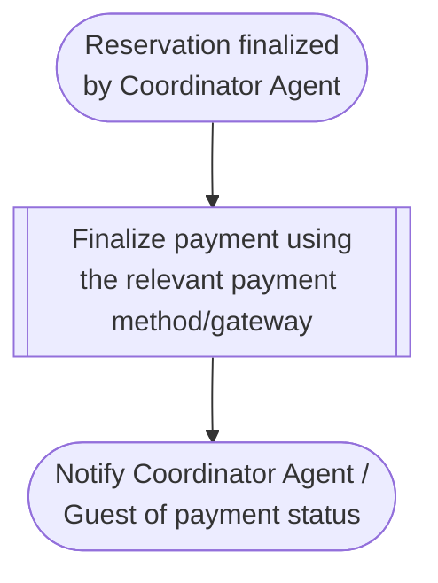

# Hotel Booking Multi-Agent System — Data Flow Diagrams (DFD)

**Document Type:** Data Flow Diagram (Levels 0–2)
**Source:** Digitized from hand-drawn architecture sketches (multi-agent hotel booking assistant)
**Notation:** Gane & Sarson style — Process (rounded box), External Entity (square), Data Store (open rectangle), Data Flow (labeled arrow)

---

## Legend

| Symbol | Meaning |
|---|---|
| `(( ))` | Process — a unit of work performed by an agent |
| `[ ]` | External Entity — outside the system boundary |
| `[( )]` / cylinder | Data Store — memory, database, or document store |
| `-->` | Data Flow — direction of data movement, labeled with what moves |

---

## Level 0 — Context Diagram

The system as a single black box, showing only its boundary with the outside world.

---

## Level 1 — System Overview DFD

Breaks the black box into its top-level agents and data stores.

**Orchestration order (as sketched):** the Coordinator Agent routes to sub-agents roughly in this sequence:
1. Reservation Agent
2. Booking Policy Agent (interruptible — see routing rule below)
3. Upsell Options Recommend Agent *(marked "will be implemented later")*
4. Smart Pricing Agent *(marked "will be implemented later")*
5. Payment Agent

### Agent Tools (Tool/API Layer)

Each agent reads and writes its data store(s) through a defined tool/API, rather than touching the underlying store directly. This keeps agent logic decoupled from how each store is actually implemented (today: in-memory mock arrays; target: persistent, tool-backed storage — see note under D1/D2 in the Data Dictionary).

| Agent | Tools / APIs Called |
|---|---|
| **P1 — Root Agent** | `save_guest_identity(name, email, phone)` — write to D1 · `get_guest_identity(guest_id)` — read from D1 |
| **P2 — Coordinator Agent** | `get_guest_identity(guest_id)` — read D1 · `get_booking_state(session_id)` — read D2 · `route_to_agent(agent_name, context)` — internal handoff tool (no data store) |
| **P3 — Reservation Agent** | `save_booking_field(session_id, field, value)` — write to D2 · `get_booking_state(session_id)` — read D2 · `get_room_availability(check_in, check_out)` — read Room Inventory *(not yet implemented — see Assumptions)* |
| **P4 — Booking Policy Agent** | `search_policy_kb(query, mode="hybrid")` — semantic/keyword/hybrid search against D3 |
| **P5 — Upsell Options Recommend Agent** *(future)* | `get_booking_state(session_id)` — read D2 · `get_upsell_recommendations(booking_context)` — *tool not yet implemented* |
| **P6 — Smart Pricing Agent** *(future)* | `get_room_availability(check_in, check_out)` — read Room Inventory · `get_dynamic_price(room_type, demand_signals)` — *tool not yet implemented* |
| **P7 — Payment Agent** | `get_booking_state(session_id)` — read D2 · `create_payment(session_id, amount, method)` — calls the payment gateway · `get_payment_status(payment_id)` |

> Tools shown as *not yet implemented* correspond to gaps already flagged elsewhere in this document (Room Inventory data store) or to agents explicitly marked as future work (P5, P6).

---

## Level 2 — P1: Root Agent Process

Collects the guest's identity before handing off to the Coordinator Agent.

**Tools used:** `save_guest_identity(name, email, phone)` on each write step below; `get_guest_identity(guest_id)` when the Coordinator later needs the stored identity.

---

## Level 2 — P3: Reservation Agent Process

Collects all booking-specific details. Every field collected is written to the Conversation Memory data store as it goes.

**Tools used:** `save_booking_field(session_id, field, value)` on each write step below; `get_room_availability(check_in, check_out)` at the room-types step (B4); `get_booking_state(session_id)` if a prior step needs to be re-read (e.g., after returning from the Booking Policy Agent).

---

## Level 2 — P4: Booking Policy Agent Process

A RAG-backed agent. Answers questions by retrieving from the Booking Policy Knowledge Base (this is the same knowledge base built in the notebook's Steps 2–4 — semantic/keyword/hybrid search over `hotel_booking_policies.md`).

**Tools used:** `search_policy_kb(query, mode="hybrid")` at the RAG lookup step.

**Routing rule (applies across the whole system):** every agent *except* the Booking Policy Agent itself, after completing its own step, asks the guest whether they have a booking-policy-related question. If yes, control routes to the Booking Policy Agent; once answered, control returns to the point it left off. If no, the flow continues to the next agent in the Coordinator's sequence.

---

## Level 2 — P7: Payment Agent Process

**Tools used:** `get_booking_state(session_id)` to pull the confirmed reservation before charging; `create_payment(session_id, amount, method)` at the "Finalize payment" step; `get_payment_status(payment_id)` to confirm status before notifying.

---

## Data Dictionary

| Data Store | Contents | Written by | Read by |
|---|---|---|---|
| **D1 — Root Agent Memory** | First name, last name, email, phone number | P1 (Root Agent) | P2 (Coordinator Agent) |
| **D2 — Conversation Memory** | Check-in/out dates, adult & child counts, child ages, selected room type, meal plan | P3 (Reservation Agent) | P2, P7 (for payment/reservation summary) |
| **D3 — Booking Policy Knowledge Base** | Vectorized chunks of `hotel_booking_policies.md` (embeddings + text), queried via semantic/keyword/hybrid search | Ingestion pipeline (Step 2 of the RAG notebook) | P4 (Booking Policy Agent) |

> **Implementation note:** D1 and D2 are currently implemented as in-memory mock arrays rather than persistent storage. Agents already access them through the tool names listed above (e.g., `save_guest_identity`, `save_booking_field`) rather than touching the arrays directly, which means swapping the mock arrays for real persistent storage should not require changing any agent logic — only the implementation behind each tool.

| Process | Role |
|---|---|
| **P1 — Root Agent** | Entry point; collects identity, then routes to the Coordinator |
| **P2 — Coordinator Agent** | Orchestrates all specialist agents in sequence, holds overall conversation state |
| **P3 — Reservation Agent** | Collects dates, occupancy, room selection, meal plan |
| **P4 — Booking Policy Agent** | RAG-based Q&A over hotel policy documents; reachable from any other agent on demand |
| **P5 — Upsell Options Recommend Agent** | *Not yet implemented* — will suggest upgrades/add-ons |
| **P6 — Smart Pricing Agent** | *Not yet implemented* — will handle dynamic pricing |
| **P7 — Payment Agent** | Finalizes payment after reservation details are confirmed |

*(See "Agent Tools (Tool/API Layer)" table above the Level 2 diagrams for the specific tool/API each process calls.)*

---

## Assumptions & Notes

- The sketches are hand-drawn and partially illegible in places; the following interpretations were made from context:
  - The circular icon near "Root Agent" with an arrow to/from the User in Image 1 (crossed out, hard to read) is not represented as a distinct process here — it wasn't clearly labeled, so it's omitted rather than guessed at. Worth clarifying if it represents a specific interface (e.g. a chat widget or channel) that should be its own external entity.
  - "meq plan" / "mta plan" near the end of the Reservation Agent flow was interpreted as **meal plan**, consistent with standard hotel booking flows.
  - The room-availability step ("show available room types and in each type how many available") implies a Room Inventory data store that the Reservation Agent reads from — not explicitly drawn in the sketches, so it's called out here as a likely missing data store rather than added to the diagrams.
- Upsell Options Recommend Agent and Smart Pricing Agent are included in the Level 1 diagram for completeness of the architecture, but are explicitly marked as future work per the source notes.

---

*This document is a structured re-drawing of hand-sketched notes for a multi-agent hotel booking assistant. Diagrams use Mermaid syntax and will render as flowcharts in any Markdown viewer that supports Mermaid (GitHub, most modern Markdown editors, Claude, etc.).*
